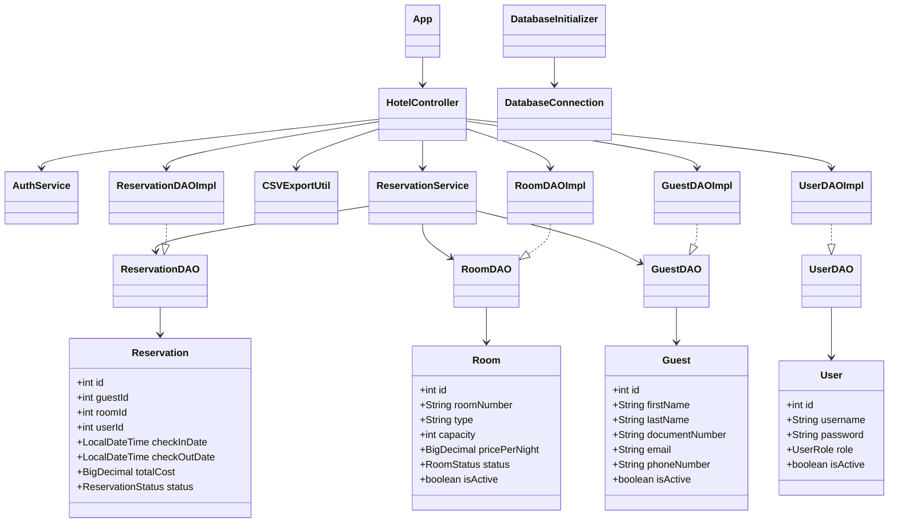
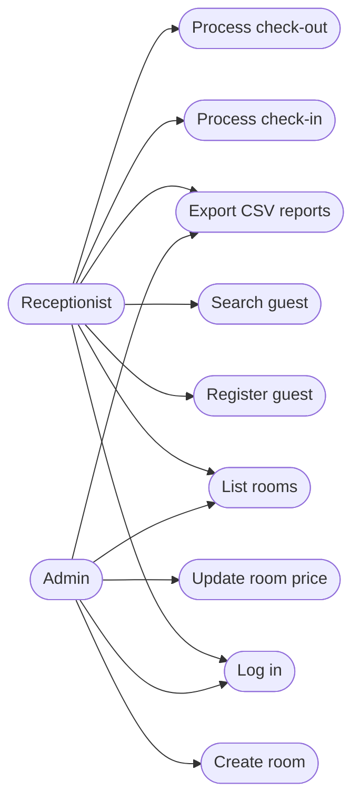

# HotelNova System

HotelNova System is a Java 17 desktop application for hotel room, guest, user, and reservation management. The project follows a 4-layer architecture with JDBC-based persistence, service-level business rules, and a Swing entry point.

## Architecture

The application is organized into four layers:

1. `model`: Domain entities such as `Room`, `Guest`, `User`, and `Reservation`.
2. `dao`: Persistence contracts and JDBC implementations responsible for database access.
3. `service`: Business workflows such as authentication, check-in, and check-out with transaction handling.
4. `controller` and `App`: Application orchestration and the Swing user interface.

## Project Structure

```text
src/main/java/com/hotelnova
├── controller
├── dao
│   └── impl
├── database
├── exception
├── model
├── service
└── util
```

## Configuration Guide

Application properties are stored in `src/main/resources/config.properties`.

```properties
db.url=jdbc:mysql://localhost:3306/hotel_nova_db
db.user=root
db.password=1234
checkInHour=15
checkOutHour=12
vat=0.19
```

Configuration keys:

- `db.url`: MySQL JDBC URL for the HotelNova database.
- `db.user`: Database username.
- `db.password`: Database password.
- `checkInHour`: Default check-in hour.
- `checkOutHour`: Default check-out hour.
- `vat`: VAT rate used during check-out totals.

## Database Initialization

At startup, `DatabaseInitializer.initialize()`:

- Creates the database if it does not exist.
- Executes the DDL in `hotel_nova_db_ddl.sql`.
- Seeds default users when needed:
  - `admin` / seeded for compatibility with previous versions
  - `qa_admin` / `QaAdmin123!`
  - `qa_recep` / `QaRecep123!`

Required local prerequisites:

- Java 17
- Maven 3.9+
- MySQL 8+

## Running the Application

```bash
mvn clean compile
mvn exec:java -Dexec.mainClass=com.hotelnova.App
```

## Running Tests

```bash
mvn test
```

## CSV Exports

The controller export flow generates:

- `rooms_export.csv`
- `active_reservations.csv`

## Mermaid Class Diagram



## Mermaid Use Case Diagram


