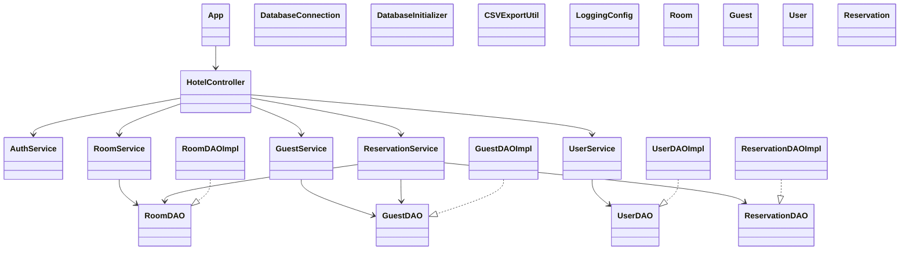
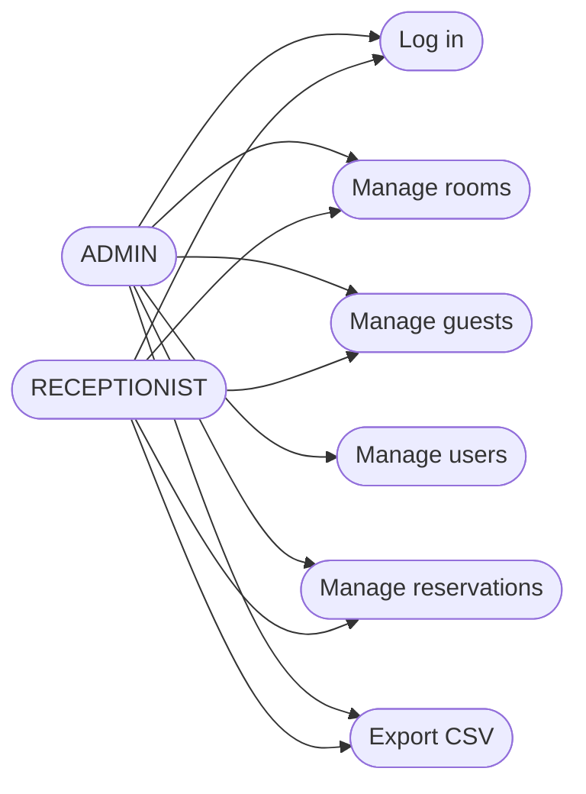

# HotelNova System

Java SE 17 application for the internal management of HotelNova rooms, guests, users, and reservations. The system uses `JOptionPane` as its graphical interface, `JDBC + MySQL` for persistence, a layered architecture, and business rules centered on availability, authentication, and traceability.

## Coder Information

- Name: Camilo Villada
- Clan: Hamilton
- Email: Pending
- Document ID: Pending

## Implemented Features

- Login with `ADMIN` and `RECEPTIONIST` roles.
- Passwords stored and verified with `BCrypt`.
- Room management:
  - register
  - edit
  - activate/deactivate
  - delete
  - list and filter by type or status
- Guest management:
  - register
  - edit
  - activate/deactivate
  - search by document
  - list
- User management:
  - register
  - edit
  - activate/deactivate
  - delete
  - list
- Reservation management:
  - transactional check-in
  - transactional check-out
  - overlap validation
  - active guest validation
  - date validation
  - active reservation validation for check-out
- CSV exports:
  - `rooms_export.csv`
  - `active_reservations.csv`
  - extra compatibility with `habitaciones_export.csv`
  - extra compatibility with `reservas_activas.csv`
- Logs in the console and the `app.log` file.

## Layered Architecture

```text
src/main/java/com/hotelnova
├── controller
├── dao
│   └── impl
├── database
├── exception
├── model
├── service
└── util
```

- `model`: domain entities.
- `dao`: JDBC contracts and implementations.
- `service`: business rules, validations, and hashing.
- `controller`: coordination between UI and services.
- `util`: configuration, exports, and logging.

## Prerequisites

- Java 17 or higher
- Maven 3.9 or higher
- MySQL 8 or higher

## Configuration

File: `src/main/resources/config.properties`

```properties
db.url=jdbc:mysql://localhost:3306/hotel_nova_db
db.user=root
db.password=1234
checkInHour=15
checkOutHour=12
vat=0.19
horaCheckIn=15
horaCheckOut=12
iva=0.19
```

Primary keys used by the application:

- `db.url`
- `db.user`
- `db.password`
- `checkInHour`
- `checkOutHour`
- `vat`

Legacy keys supported for compatibility:

- `horaCheckIn`
- `horaCheckOut`
- `iva`

## Database

When the application starts, `DatabaseInitializer.initialize()` runs and performs:

1. Database creation if it does not exist.
2. Execution of the `hotel_nova_db_ddl.sql` script.
3. Creation or update of seed users with known credentials.

Test users:

- `admin` / `admin123`
- `qa_admin` / `qaadmin123`
- `qa_recep` / `recep123`

## Run

```bash
mvn clean compile
mvn exec:java -Dexec.mainClass=com.hotelnova.App
```

## Tests

```bash
mvn test
```

The current suite validates, among other points:

- room number uniqueness
- valid reservation dates
- active guest requirement
- non-overlapping reservations
- check-out only with an active reservation
- VAT cost calculation
- CSV export
- role-based menus

## Screenshots

Section prepared to attach real screenshots of:

- Login
- Main menu `ADMIN`
- Main menu `RECEPTIONIST`
- Room management
- Reservation management

## Class Diagram



## Use Case Diagram



## Logs and Generated Files

- `app.log`: application traces.
- `rooms_export.csv`: primary room export.
- `active_reservations.csv`: primary active reservation export.
- `habitaciones_export.csv`: legacy compatibility file.
- `reservas_activas.csv`: legacy compatibility file.
